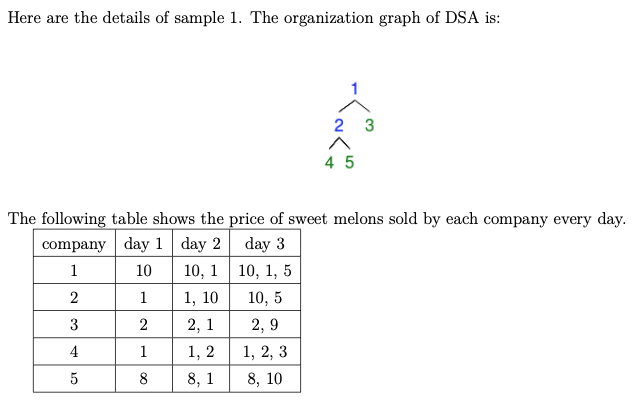

# Problem - Everyone Loves Sweetmelons

- Time Limit: 1 s
- Memory Limit: 2048 KB

## Problem Description
Devine Sweetmelon Agency (a.k.a. DSA) is an internationally renowned group company selling sweet melons. Based on credible sources, DSA comprises N companies, numbered from 1 to N, where the company numbered 1 is the topmost company in DSA. The organizational structure of DSA is quite straightforward: the i-th company, except the topmost company, has exactly one parent company xi.

Chicken-Soup has a strong liking for sweet melons and desires to eat as many sweet melons as possible. To achieve this goal, Chicken-Soup conducts an investigation and obtains the sales plans of DSA for the next M days. According to the sales plans, every day, each company in DSA will launch a sales event that lasts for several days. Specifically, the sales event of company i on day j would offer sweet melons at a price of cij dollars and will last for dij days. This implies that Chicken-Soup can purchase sweet melons at the price of cij on day j, j + 1, . . . , j + dij - 1.

In order to simplify the purchase process, Chicken-Soup decides to sign a contract with exactly one company in DSA every day. The contract requires ze to buy exactly one sweet melon from the contracting company and each of its offspring companies on the same day. However, despite wanting to purchase all the sweet melons, Chicken-Soup’s daily pocket money is limited to C dollars. In addition, Chicken-Soup cannot carry over the daily pocket money to the next day. Given the constraint, can you help calculate the maximum number of sweet melons that Chicken-Soup can purchase each day?

### Input
The first line contains three space-separated integers N, M, and C, which are the number of companies, the length of sales events, and Chicken-Soup’s daily pocket money, respectively. The second line contains N − 1 space-separated integers x2, x3, . . . , xN, where xi represents the parent company of company i. The next input lines can be divided into M parts, each representing the sales plan on the j-th day for j = 1, 2, ..., M. Each part contains N lines, and the i-th line of the j-th part contains two space-separated integers cij, dij, which are the price and the length of the sales plan of company i on day j.

### Output
The output should consist of M lines, and the j-th line should be the maximum number of sweet melons that Chicken-Soup can purchase on day j.

### Constraints

- 1 ≤ N, M ≤ 10^6
- 1 ≤ C ≤ 10^9
- 1 ≤ xi ≤ N
- 0 ≤ dij ≤ M
- 0 ≤ cij ≤ C

### Subtask 1 (10 pts)
- 1 ≤ N, M ≤ 10^3

### Subtask 2 (15 pts)
- xi = i - 1, i ∈ {2, 3, ..., N}

### Subtask 3 (15 pts)
- dij = M

### Subtask 4 (60 pts)
- No other constraints.

### Sample Input 1
5 5 10
2 3 2 5
1 2
10 1
1 10
2 1
1 1
10 1
1 10
2 9
8 1
8 10

### Sample Output 1
3
5
1

### Hints

- On the first day, Chicken-Soup can sign a contract with company 2 and buy sweet melons at prices 1, 1, 8 from companies 2, 4, 5 respectively.
- On the second day, Chicken-Soup can sign a contract with company 1 and buy sweet melons at prices 1, 1, 2, 2, 1 from companies 1, 2, 3, 4, 5 respectively.
- On the third day, Chicken-Soup can sign a contract with company 5 and buy one sweet melon at price 8 from company 5.

## Program Analysis

### Main Function
- 首先讀取公司數量N、天數M和Chicken-Soup的每日預算C。
- 接著讀取N-1個整數，代表除了頂層公司外每家公司的父公司。
- 針對接下來的M天，每天讀取N行，每行包含兩個整數cij和dij，分別表示第i家公司第j天的甜瓜價格和促銷時間。
- 根據讀取的數據建立一個樹狀結構來代表DSA的組織架構，並為每家公司添加促銷計劃。
- 對於每一天的促銷計劃，計算Chicken-Soup可以購買的最大甜瓜數量並輸出。

### Key Functions
- `calculate`：遍歷公司的樹狀結構，計算以每家公司為起點時，根據當天的促銷計劃和Chicken-Soup的預算限制，可以購買的甜瓜總數和總費用。
- `cal_cost`&`cal_count`：輔助`calculate`函數，計算從當前節點開始的子樹中甜瓜的總費用和總數量。
- `creat_discount`：為每家公司添加當天的促銷計劃，並在必要時進行調整以維持最小堆的性質，以便快速獲取當天最便宜的甜瓜價格。
- `compare`：在`creat_discount`中使用，幫助維護最小堆性質，確保頂點是當前可用促銷中最便宜的。

### Algorithmic Approach
- 通過建立一個樹狀結構來表示DSA的組織架構，每個節點代表一家公司，並包含該公司的促銷計劃。
- 使用深度優先搜索（DFS）遍歷樹，對於每一天的促銷計劃，計算從每個節點（公司）開始可以購買的最大甜瓜數量。
- 利用最小堆來快速獲取和更新每家公司當天甜瓜的最低價格。

### Efficiency Considerations
- 利用樹狀結構來有效管理公司間的關係和促銷計劃，減少了對促銷信息的重複計算。
- 通過維持最小堆的性質，快速從多個促銷計劃中選擇出最優惠的價格，提高了計算效率。